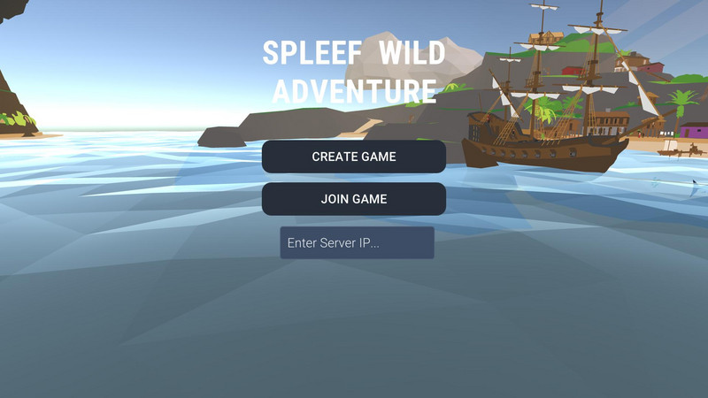
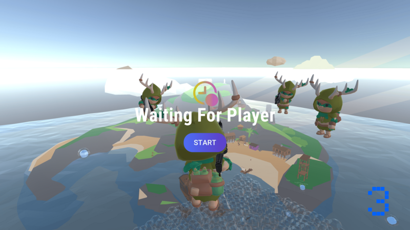
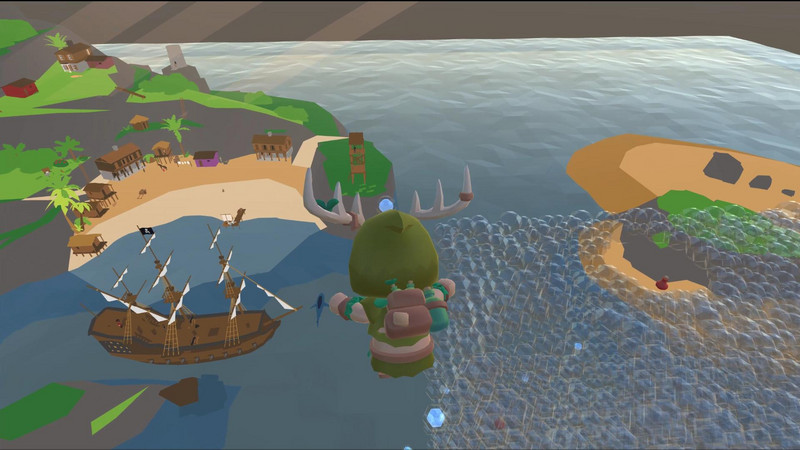
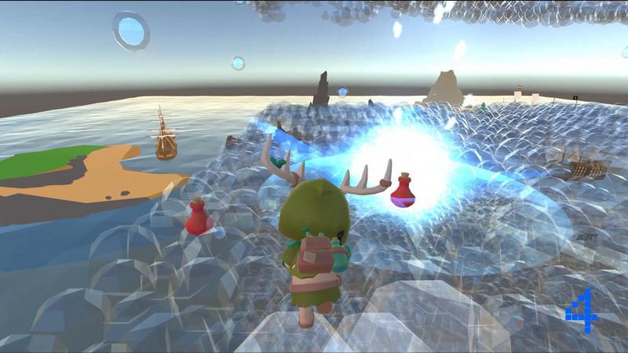

# 🚀 Spleef Wild Adventure (Global Game Jam 2025) 🎮

## 🌟 About the Game  
A fast-paced multiplayer battle arena where players race, dodge, and blast bubbles to outlast their opponents! Inspired by the famous Minecraft Spleef mod, players must strategically break bubble platforms beneath their rivals while avoiding falling into the abyss themselves.  
This game captures the essence of the GGJ2024 theme: **"Bubble"**.

- **GGJ Page:** https://globalgamejam.org/games/2025/spleef-wild-adventure-4
- **Genre:** Platformer, Multiplayer, PVP
- **Engine:** Unity (with [Mirro Framework](https://github.com/MirrorNetworking/Mirror) )
- **Platform:** Windows, Mac, Web, Linux (Dedicated Server)
- **Team (in alphabetical order):**   
  [@bglossner](https://github.com/bglossner) • [@caseyavila](https://github.com/caseyavila) • [@JefferNg](https://github.com/JefferNg) • [@314pies](https://github.com/314pies) 

---

## 🛠 Installation & Play  

### Play in your browser!
🎮 Play it now on:  http://spleef-wild-adventure-webgl-hosting-1.s3-website-us-west-1.amazonaws.com/

  - Follow the instruction on main menu to join the Discord channel and spin up the game server 
---
### Download & Run Locally  
#### Clients/Host
Host/Join game by download releases for your platform:  
https://github.com/314pies/GGJ-2025/tree/main/Release

#### Linux Dedicate Server
Linux Dedicate Server can be downloaded here:  
https://github.com/314pies/GGJ-2025/tree/main/Release/HeadlessServer

---

## 📸 Screenshots  
|  |  |   
|:--:|:--:|  
|  |  | 